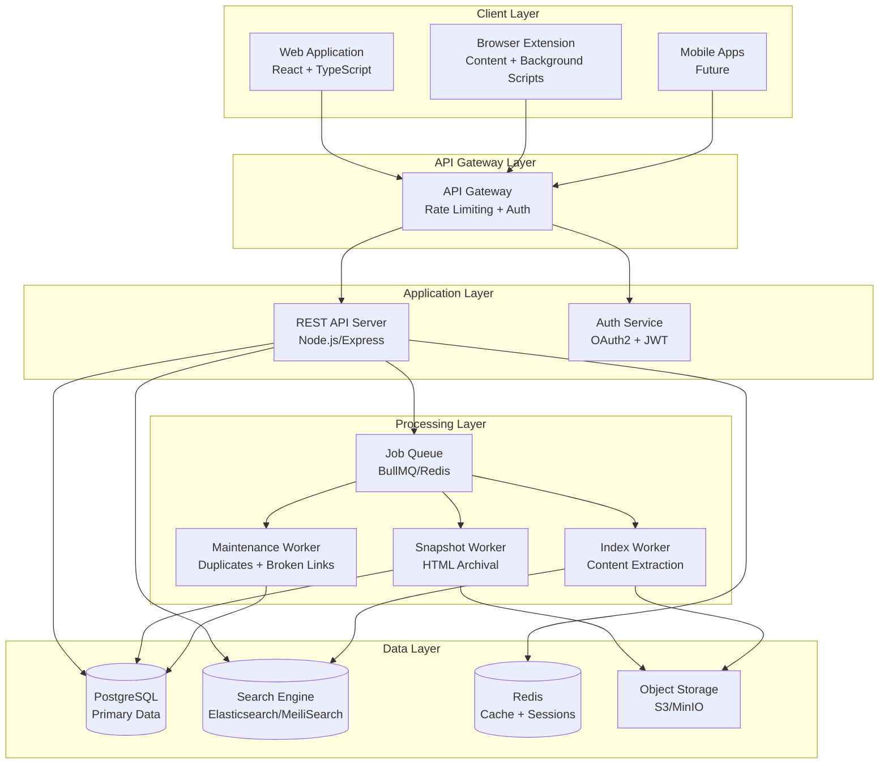
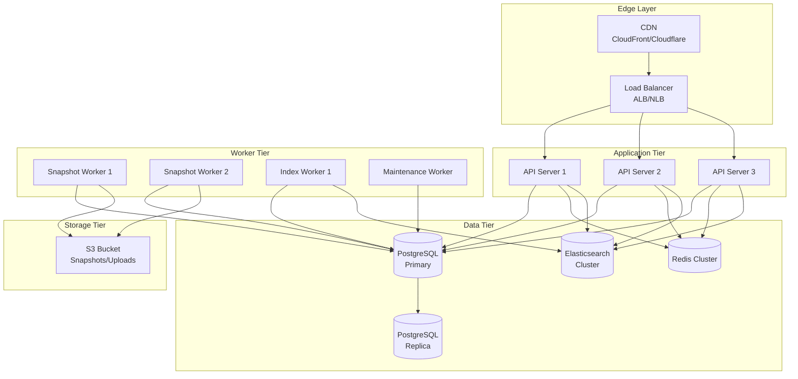

# Design Document

## Overview

The Bookmark Manager Platform is a full-stack web application that enables users to save, organize, search, and share web bookmarks with advanced features including permanent archival, full-text search, annotations, and collaboration. The system follows a microservices-inspired architecture with clear separation between the API layer, background processing, search indexing, and storage.

The platform serves three primary client types:

1. **Web Application** - React-based SPA for desktop and mobile browsers
2. **Browser Extensions** - Chrome/Firefox/Safari/Edge extensions for quick bookmark capture
3. **Public API** - RESTful API for third-party integrations

The system implements a freemium model with a free tier providing core bookmarking functionality and a Pro tier unlocking advanced features like full-text search, permanent copies, annotations, and automated backups.

## Architecture

### High-Level Architecture



### Technology Stack

**Frontend:**

- React 18 with TypeScript
- Vite for build tooling
- Tailwind CSS for styling
- Zustand for state management
- React Query for server state and caching
- React Router for navigation

**Backend:**

- Node.js 20+ with Express.js
- TypeScript for type safety
- OpenAPI 3.0 specification
- Passport.js for OAuth2/JWT
- BullMQ for job queue management

**Data Storage:**

- PostgreSQL 15+ (primary database)
- Redis 7+ (cache, sessions, job queue)
- Elasticsearch 8+ or MeiliSearch (full-text search)
- S3-compatible object storage (AWS S3 or MinIO)

**Browser Extension:**

- Manifest V3 for Chrome/Edge/Brave
- WebExtensions API for Firefox
- Safari Web Extensions for Safari
- Shared TypeScript codebase

**Infrastructure:**

- Docker for containerization
- Kubernetes for orchestration
- Terraform for infrastructure as code
- GitHub Actions for CI/CD

**Testing:**

- Vitest for unit tests
- Playwright for E2E tests
- fast-check for property-based testing

## Components and Interfaces

### 1. REST API Server

The API server provides RESTful endpoints for all client operations. It follows OpenAPI 3.0 specification for documentation and validation.

**Core Responsibilities:**

- Request validation and sanitization
- Authentication and authorization
- Business logic orchestration
- Response formatting
- Job queue management

**Key Endpoints:**

```typescript
// Authentication
POST   /v1/auth/register
POST   /v1/auth/login
POST   /v1/auth/refresh
POST   /v1/auth/logout
GET    /v1/auth/oauth/authorize
POST   /v1/auth/oauth/token

// User Management
GET    /v1/user
PUT    /v1/user
DELETE /v1/user
GET    /v1/user/stats

// Collections
GET    /v1/collections
POST   /v1/collections
GET    /v1/collections/:id
PUT    /v1/collections/:id
DELETE /v1/collections/:id
POST   /v1/collections/:id/share
DELETE /v1/collections/:id/share/:userId

// Bookmarks (Raindrops)
GET    /v1/bookmarks
POST   /v1/bookmarks
GET    /v1/bookmarks/:id
PUT    /v1/bookmarks/:id
DELETE /v1/bookmarks/:id
POST   /v1/bookmarks/bulk
GET    /v1/bookmarks/:id/snapshot
GET    /v1/bookmarks/:id/highlights

// Tags
GET    /v1/tags
POST   /v1/tags
PUT    /v1/tags/:id
DELETE /v1/tags/:id
POST   /v1/tags/merge

// Highlights (Pro)
GET    /v1/highlights
POST   /v1/highlights
PUT    /v1/highlights/:id
DELETE /v1/highlights/:id

// Search
GET    /v1/search

// Files (Pro)
POST   /v1/files/upload
GET    /v1/files/:id
DELETE /v1/files/:id

// Backups (Pro)
GET    /v1/backups
POST   /v1/backups/generate
GET    /v1/backups/:id/download

// Import/Export
POST   /v1/import/html
POST   /v1/import/json
GET    /v1/export/:collectionId
```

### 2. Database Schema

**PostgreSQL Schema:**

```sql
-- Users table
CREATE TABLE users (
    id UUID PRIMARY KEY DEFAULT gen_random_uuid(),
    email VARCHAR(255) UNIQUE NOT NULL,
    password_hash VARCHAR(255) NOT NULL,
    name VARCHAR(255),
    plan VARCHAR(20) DEFAULT 'free' CHECK (plan IN ('free', 'pro')),
    created_at TIMESTAMP DEFAULT NOW(),
    updated_at TIMESTAMP DEFAULT NOW()
);

-- Collections table
CREATE TABLE collections (
    id UUID PRIMARY KEY DEFAULT gen_random_uuid(),
    owner_id UUID NOT NULL REFERENCES users(id) ON DELETE CASCADE,
    title VARCHAR(255) NOT NULL,
    icon VARCHAR(100),
    is_public BOOLEAN DEFAULT FALSE,
    share_slug VARCHAR(50) UNIQUE,
    parent_id UUID REFERENCES collections(id) ON DELETE SET NULL,
    sort_order INTEGER,
    created_at TIMESTAMP DEFAULT NOW(),
    updated_at TIMESTAMP DEFAULT NOW()
);

-- Bookmarks (Raindrops) table
CREATE TABLE bookmarks (
    id UUID PRIMARY KEY DEFAULT gen_random_uuid(),
    owner_id UUID NOT NULL REFERENCES users(id) ON DELETE CASCADE,
    collection_id UUID REFERENCES collections(id) ON DELETE SET NULL,
    title VARCHAR(500) NOT NULL,
    url TEXT NOT NULL,
    excerpt TEXT,
    content_snapshot_path TEXT,
    content_indexed BOOLEAN DEFAULT FALSE,
    type VARCHAR(20) CHECK (type IN ('article', 'video', 'image', 'file', 'document')),
    domain VARCHAR(255),
    cover_url TEXT,
    is_duplicate BOOLEAN DEFAULT FALSE,
    is_broken BOOLEAN DEFAULT FALSE,
    custom_order INTEGER,
    created_at TIMESTAMP DEFAULT NOW(),
    updated_at TIMESTAMP DEFAULT NOW()
);

-- Tags table
CREATE TABLE tags (
    id UUID PRIMARY KEY DEFAULT gen_random_uuid(),
    owner_id UUID NOT NULL REFERENCES users(id) ON DELETE CASCADE,
    name VARCHAR(100) NOT NULL,
    normalized_name VARCHAR(100) NOT NULL,
    color VARCHAR(7),
    created_at TIMESTAMP DEFAULT NOW(),
    UNIQUE(owner_id, normalized_name)
);

-- Bookmark-Tag junction table
CREATE TABLE bookmark_tags (
    bookmark_id UUID NOT NULL REFERENCES bookmarks(id) ON DELETE CASCADE,
    tag_id UUID NOT NULL REFERENCES tags(id) ON DELETE CASCADE,
    PRIMARY KEY (bookmark_id, tag_id)
);

-- Highlights table (Pro feature)
CREATE TABLE highlights (
    id UUID PRIMARY KEY DEFAULT gen_random_uuid(),
    bookmark_id UUID NOT NULL REFERENCES bookmarks(id) ON DELETE CASCADE,
    owner_id UUID NOT NULL REFERENCES users(id) ON DELETE CASCADE,
    text_selected TEXT NOT NULL,
    color VARCHAR(7) DEFAULT '#FFFF00',
    annotation_md TEXT,
    position_context JSONB,
    snapshot_id VARCHAR(255),
    created_at TIMESTAMP DEFAULT NOW(),
    updated_at TIMESTAMP DEFAULT NOW()
);

-- Files table (Pro feature)
CREATE TABLE files (
    id UUID PRIMARY KEY DEFAULT gen_random_uuid(),
    owner_id UUID NOT NULL REFERENCES users(id) ON DELETE CASCADE,
    bookmark_id UUID REFERENCES bookmarks(id) ON DELETE CASCADE,
    filename VARCHAR(255) NOT NULL,
    mime_type VARCHAR(100) NOT NULL,
    size_bytes BIGINT NOT NULL,
    s3_path TEXT NOT NULL,
    created_at TIMESTAMP DEFAULT NOW()
);

-- Backups table (Pro feature)
CREATE TABLE backups (
    id UUID PRIMARY KEY DEFAULT gen_random_uuid(),
    owner_id UUID NOT NULL REFERENCES users(id) ON DELETE CASCADE,
    file_path TEXT NOT NULL,
    size_bytes BIGINT,
    auto_generated BOOLEAN DEFAULT FALSE,
    created_at TIMESTAMP DEFAULT NOW()
);

-- Collection permissions table (Pro feature)
CREATE TABLE collection_permissions (
    id UUID PRIMARY KEY DEFAULT gen_random_uuid(),
    collection_id UUID NOT NULL REFERENCES collections(id) ON DELETE CASCADE,
    user_id UUID NOT NULL REFERENCES users(id) ON DELETE CASCADE,
    role VARCHAR(20) NOT NULL CHECK (role IN ('owner', 'editor', 'viewer')),
    created_at TIMESTAMP DEFAULT NOW(),
    UNIQUE(collection_id, user_id)
);

-- Reminders table (Pro feature)
CREATE TABLE reminders (
    id UUID PRIMARY KEY DEFAULT gen_random_uuid(),
    bookmark_id UUID NOT NULL REFERENCES bookmarks(id) ON DELETE CASCADE,
    owner_id UUID NOT NULL REFERENCES users(id) ON DELETE CASCADE,
    remind_at TIMESTAMP NOT NULL,
    notification_channels JSONB DEFAULT '["in_app"]',
    completed BOOLEAN DEFAULT FALSE,
    created_at TIMESTAMP DEFAULT NOW()
);

-- OAuth clients table
CREATE TABLE oauth_clients (
    id UUID PRIMARY KEY DEFAULT gen_random_uuid(),
    client_id VARCHAR(255) UNIQUE NOT NULL,
    client_secret_hash VARCHAR(255),
    name VARCHAR(255) NOT NULL,
    redirect_uris TEXT[] NOT NULL,
    is_public BOOLEAN DEFAULT FALSE,
    created_at TIMESTAMP DEFAULT NOW()
);

-- OAuth tokens table
CREATE TABLE oauth_tokens (
    id UUID PRIMARY KEY DEFAULT gen_random_uuid(),
    user_id UUID NOT NULL REFERENCES users(id) ON DELETE CASCADE,
    client_id UUID NOT NULL REFERENCES oauth_clients(id) ON DELETE CASCADE,
    access_token VARCHAR(500) UNIQUE NOT NULL,
    refresh_token VARCHAR(500) UNIQUE,
    scopes TEXT[],
    expires_at TIMESTAMP NOT NULL,
    created_at TIMESTAMP DEFAULT NOW()
);

-- Indexes for performance
CREATE INDEX idx_bookmarks_owner ON bookmarks(owner_id);
CREATE INDEX idx_bookmarks_collection ON bookmarks(collection_id);
CREATE INDEX idx_bookmarks_created ON bookmarks(created_at DESC);
CREATE INDEX idx_bookmarks_domain ON bookmarks(domain);
CREATE INDEX idx_bookmarks_url_hash ON bookmarks(md5(url));
CREATE INDEX idx_collections_owner ON collections(owner_id);
CREATE INDEX idx_tags_owner ON tags(owner_id);
CREATE INDEX idx_tags_normalized ON tags(normalized_name);
CREATE INDEX idx_highlights_bookmark ON highlights(bookmark_id);
CREATE INDEX idx_reminders_remind_at ON reminders(remind_at) WHERE NOT completed;
```

### 3. Search Engine Integration

The search engine provides full-text search capabilities across bookmark content, titles, excerpts, and metadata.

**Search Index Schema (Elasticsearch/MeiliSearch):**

```json
{
  "mappings": {
    "properties": {
      "id": { "type": "keyword" },
      "owner_id": { "type": "keyword" },
      "collection_id": { "type": "keyword" },
      "title": {
        "type": "text",
        "analyzer": "standard",
        "fields": {
          "keyword": { "type": "keyword" }
        }
      },
      "url": { "type": "keyword" },
      "domain": { "type": "keyword" },
      "excerpt": { "type": "text" },
      "content": {
        "type": "text",
        "analyzer": "standard"
      },
      "tags": { "type": "keyword" },
      "type": { "type": "keyword" },
      "created_at": { "type": "date" },
      "updated_at": { "type": "date" },
      "has_snapshot": { "type": "boolean" },
      "highlights_text": { "type": "text" }
    }
  }
}
```

**Search Query Builder:**

```typescript
interface SearchQuery {
  q?: string; // Full-text query
  tags?: string[]; // Filter by tags
  type?: string[]; // Filter by type
  domain?: string[]; // Filter by domain
  collection?: string; // Filter by collection
  dateFrom?: Date; // Date range start
  dateTo?: Date; // Date range end
  fulltext?: boolean; // Enable content search (Pro)
  page?: number; // Pagination
  limit?: number; // Results per page
}

interface SearchResult {
  id: string;
  title: string;
  url: string;
  excerpt: string;
  highlights: string[]; // Matched snippets
  score: number; // Relevance score
}
```

### 4. Background Workers

Background workers handle asynchronous processing tasks that would block user-facing operations.

**Snapshot Worker:**

```typescript
interface SnapshotJob {
  bookmarkId: string;
  url: string;
  userId: string;
  userPlan: 'free' | 'pro';
}

class SnapshotWorker {
  async process(job: SnapshotJob): Promise<void> {
    // 1. Fetch page HTML with Playwright/Puppeteer
    const html = await this.fetchPage(job.url);

    // 2. Extract main content (remove ads, nav, etc.)
    const cleanedContent = await this.extractMainContent(html);

    // 3. Generate screenshot thumbnail
    const thumbnail = await this.captureScreenshot(job.url);

    // 4. Store snapshot in S3
    const snapshotPath = await this.storeSnapshot({
      html: cleanedContent,
      thumbnail,
      bookmarkId: job.bookmarkId,
    });

    // 5. Update bookmark record
    await this.updateBookmark(job.bookmarkId, {
      content_snapshot_path: snapshotPath,
      cover_url: thumbnail,
    });

    // 6. Enqueue indexing job
    await this.enqueueIndexJob(job.bookmarkId);
  }
}
```

**Index Worker:**

```typescript
interface IndexJob {
  bookmarkId: string;
  snapshotPath: string;
  type: 'article' | 'video' | 'image' | 'file' | 'document';
}

class IndexWorker {
  async process(job: IndexJob): Promise<void> {
    // 1. Retrieve snapshot from S3
    const content = await this.retrieveSnapshot(job.snapshotPath);

    // 2. Extract text based on type
    let text: string;
    if (job.type === 'file') {
      text = await this.extractPDFText(content);
    } else {
      text = await this.extractHTMLText(content);
    }

    // 3. Clean and normalize text
    const cleanedText = this.cleanText(text);

    // 4. Index in search engine
    await this.indexDocument({
      id: job.bookmarkId,
      content: cleanedText,
      ...metadata,
    });

    // 5. Update bookmark indexed status
    await this.updateBookmark(job.bookmarkId, {
      content_indexed: true,
    });
  }
}
```

**Maintenance Worker:**

```typescript
class MaintenanceWorker {
  // Duplicate detection
  async detectDuplicates(userId: string): Promise<void> {
    const bookmarks = await this.getBookmarks(userId);

    for (const bookmark of bookmarks) {
      // Normalize URL (remove UTM params, etc.)
      const normalizedUrl = this.normalizeUrl(bookmark.url);

      // Find existing bookmarks with same normalized URL
      const duplicates = await this.findByNormalizedUrl(userId, normalizedUrl);

      if (duplicates.length > 1) {
        await this.flagAsDuplicate(bookmark.id);
      }
    }
  }

  // Broken link detection
  async scanBrokenLinks(userId: string): Promise<void> {
    const bookmarks = await this.getBookmarks(userId);

    for (const bookmark of bookmarks) {
      try {
        const response = await fetch(bookmark.url, {
          method: 'HEAD',
          timeout: 10000,
        });

        if (response.status >= 400) {
          await this.flagAsBroken(bookmark.id);
        }
      } catch (error) {
        await this.flagAsBroken(bookmark.id);
      }
    }
  }
}
```

### 5. Browser Extension Architecture

The browser extension uses Manifest V3 with separate content scripts, background service worker, and popup/side panel UI.

**Extension Components:**

```typescript
// Background Service Worker
class BackgroundService {
  async saveCurrentPage(tab: Tab): Promise<void> {
    // 1. Extract metadata from page
    const metadata = await this.extractMetadata(tab);

    // 2. Get auth token from storage
    const token = await this.getAuthToken();

    // 3. Send to API
    await this.apiClient.createBookmark(
      {
        url: tab.url,
        title: metadata.title,
        excerpt: metadata.description,
        cover_url: metadata.image,
        collection_id: await this.getDefaultCollection(),
      },
      token
    );

    // 4. Show success notification
    await this.showNotification('Bookmark saved!');
  }

  async saveAllTabs(): Promise<void> {
    const tabs = await chrome.tabs.query({});
    const tag = `bulk-${new Date().toISOString().split('T')[0]}`;

    for (const tab of tabs) {
      await this.saveCurrentPage(tab);
      await this.addTag(tab.url, tag);
    }
  }
}

// Content Script
class ContentScript {
  async captureHighlight(): Promise<void> {
    const selection = window.getSelection();
    if (!selection || selection.toString().length === 0) return;

    const range = selection.getRangeAt(0);
    const context = this.getPositionContext(range);

    // Send to background script
    await chrome.runtime.sendMessage({
      type: 'SAVE_HIGHLIGHT',
      data: {
        text: selection.toString(),
        context,
        url: window.location.href,
      },
    });
  }

  private getPositionContext(range: Range): PositionContext {
    // Capture surrounding text and DOM path for re-highlighting
    return {
      before: this.getTextBefore(range, 50),
      after: this.getTextAfter(range, 50),
      xpath: this.getXPath(range.startContainer),
    };
  }
}
```

### 6. Object Storage Structure

Files are organized in S3-compatible storage with the following structure:

```
bucket-name/
├── snapshots/
│   ├── {userId}/
│   │   ├── {bookmarkId}/
│   │   │   ├── page.html
│   │   │   ├── assets/
│   │   │   │   ├── style.css
│   │   │   │   ├── image1.jpg
│   │   │   │   └── ...
│   │   │   └── thumbnail.jpg
├── uploads/
│   ├── {userId}/
│   │   ├── {fileId}.pdf
│   │   ├── {fileId}.jpg
│   │   └── ...
├── backups/
│   ├── {userId}/
│   │   ├── backup-{timestamp}.zip
│   │   └── ...
└── thumbnails/
    ├── {bookmarkId}.jpg
    └── ...
```

## Data Models

### Core Domain Models

```typescript
// User
interface User {
  id: string;
  email: string;
  name: string;
  plan: 'free' | 'pro';
  createdAt: Date;
  updatedAt: Date;
}

// Collection
interface Collection {
  id: string;
  ownerId: string;
  title: string;
  icon: string;
  isPublic: boolean;
  shareSlug?: string;
  parentId?: string;
  sortOrder: number;
  createdAt: Date;
  updatedAt: Date;
}

// Bookmark (Raindrop)
interface Bookmark {
  id: string;
  ownerId: string;
  collectionId?: string;
  title: string;
  url: string;
  excerpt?: string;
  contentSnapshotPath?: string;
  contentIndexed: boolean;
  type: 'article' | 'video' | 'image' | 'file' | 'document';
  domain: string;
  coverUrl?: string;
  isDuplicate: boolean;
  isBroken: boolean;
  customOrder?: number;
  tags: Tag[];
  highlights: Highlight[];
  createdAt: Date;
  updatedAt: Date;
}

// Tag
interface Tag {
  id: string;
  ownerId: string;
  name: string;
  normalizedName: string;
  color?: string;
  createdAt: Date;
}

// Highlight (Pro)
interface Highlight {
  id: string;
  bookmarkId: string;
  ownerId: string;
  textSelected: string;
  color: string;
  annotationMd?: string;
  positionContext: {
    before: string;
    after: string;
    xpath?: string;
  };
  snapshotId?: string;
  createdAt: Date;
  updatedAt: Date;
}

// File (Pro)
interface File {
  id: string;
  ownerId: string;
  bookmarkId?: string;
  filename: string;
  mimeType: string;
  sizeBytes: number;
  s3Path: string;
  createdAt: Date;
}

// Backup (Pro)
interface Backup {
  id: string;
  ownerId: string;
  filePath: string;
  sizeBytes: number;
  autoGenerated: boolean;
  createdAt: Date;
}

// Collection Permission (Pro)
interface CollectionPermission {
  id: string;
  collectionId: string;
  userId: string;
  role: 'owner' | 'editor' | 'viewer';
  createdAt: Date;
}

// Reminder (Pro)
interface Reminder {
  id: string;
  bookmarkId: string;
  ownerId: string;
  remindAt: Date;
  notificationChannels: ('email' | 'push' | 'in_app')[];
  completed: boolean;
  createdAt: Date;
}
```

### API Request/Response Models

```typescript
// Create Bookmark Request
interface CreateBookmarkRequest {
  url: string;
  title?: string;
  excerpt?: string;
  collectionId?: string;
  tags?: string[];
  note?: string;
}

// Create Bookmark Response
interface CreateBookmarkResponse {
  id: string;
  status: 'processing' | 'completed';
  bookmark: Bookmark;
}

// Search Request
interface SearchRequest {
  q?: string;
  tags?: string[];
  type?: string[];
  domain?: string[];
  collection?: string;
  dateFrom?: string;
  dateTo?: string;
  fulltext?: boolean;
  page?: number;
  limit?: number;
}

// Search Response
interface SearchResponse {
  results: SearchResult[];
  total: number;
  page: number;
  limit: number;
  took: number; // milliseconds
}

// Bulk Action Request
interface BulkActionRequest {
  bookmarkIds: string[];
  action: 'add_tags' | 'remove_tags' | 'move' | 'delete';
  params: {
    tags?: string[];
    collectionId?: string;
  };
}
```

## Correctness Properties

_A property is a characteristic or behavior that should hold true across all valid executions of a system-essentially, a formal statement about what the system should do. Properties serve as the bridge between human-readable specifications and machine-verifiable correctness guarantees._

Based on the prework analysis, the following correctness properties have been identified. These properties will be validated through property-based testing to ensure the system behaves correctly across all inputs.

### Property 1: Bookmark Creation Completeness

_For any_ valid bookmark data with all required fields (URL, title, excerpt, cover image, domain, type, timestamps, owner, collection), creating a bookmark should result in all fields being persisted correctly in the database.
**Validates: Requirements 1.1**

### Property 2: Bookmark Retrieval Completeness

_For any_ bookmark with associated tags and highlights, retrieving the bookmark by ID should return all stored metadata including the complete set of tags and highlights.
**Validates: Requirements 1.2**

### Property 3: Bookmark Update Consistency

_For any_ bookmark and any valid field updates, updating the bookmark should modify only the specified fields and update the modification timestamp.
**Validates: Requirements 1.3**

### Property 4: Bookmark Deletion Cascade

_For any_ bookmark with associated highlights, deleting the bookmark should remove the bookmark record and all associated highlights while preserving snapshot files.
**Validates: Requirements 1.4**

### Property 5: Duplicate Detection

_For any_ URL that already exists in a user's account, creating a new bookmark with the same URL should flag the new bookmark as a potential duplicate.
**Validates: Requirements 1.5**

### Property 6: Collection Creation Completeness

_For any_ valid collection data with all required fields (title, owner, icon, visibility, timestamps), creating a collection should result in all fields being persisted correctly.
**Validates: Requirements 2.1**

### Property 7: Bookmark Assignment

_For any_ bookmark and collection, assigning the bookmark to the collection should update the bookmark's collection reference immediately.
**Validates: Requirements 2.2**

### Property 8: Bookmark Move Atomicity

_For any_ bookmark and two collections, moving the bookmark from one collection to another should update the collection reference atomically without intermediate states.
**Validates: Requirements 2.3**

### Property 9: Collection Deletion Behavior

_For any_ collection with contained bookmarks, deleting the collection should either move all bookmarks to a default collection or delete them based on user preference, with no orphaned bookmarks.
**Validates: Requirements 2.4**

### Property 10: Tag Normalization

_For any_ tag name with varying cases (e.g., "JavaScript", "javascript", "JAVASCRIPT"), adding the tag to bookmarks should normalize all variations to the same tag entity.
**Validates: Requirements 3.1**

### Property 11: Tag Filtering Accuracy

_For any_ set of bookmarks with various tag combinations and any tag filter query, filtering should return only bookmarks that have all specified tags.
**Validates: Requirements 3.2**

### Property 12: Multi-Criteria Filtering

_For any_ set of bookmarks with various attributes and any combination of type, domain, and date range filters, filtering should return only bookmarks matching all specified criteria.
**Validates: Requirements 3.3**

### Property 13: Tag Merge Consolidation

_For any_ set of source tags and a target tag, merging the source tags to the target should result in all bookmarks previously tagged with source tags now having the target tag.
**Validates: Requirements 3.5**

### Property 14: View Preference Persistence

_For any_ view mode selection (Grid, Headlines, Masonry, List), switching to that view mode should persist the preference and retrieve it correctly on subsequent sessions.
**Validates: Requirements 4.5**

### Property 15: Content Extraction Quality

_For any_ web page content, extracting main content should produce text that does not contain common boilerplate patterns (navigation menus, advertisements, footers).
**Validates: Requirements 5.4**

### Property 16: Highlight Creation with Context

_For any_ text selection from a saved page, creating a highlight should store the selected text along with surrounding context (before/after text and position information).
**Validates: Requirements 6.4**

### Property 17: Bulk Tab Save

_For any_ set of open browser tabs, triggering save all tabs should create bookmarks for all tabs and tag them with a bulk tag containing the current date.
**Validates: Requirements 6.5**

### Property 18: HTML Import Round-Trip

_For any_ valid bookmarks HTML file, importing the file and then exporting the same bookmarks should preserve the folder structure as collections and all bookmark metadata.
**Validates: Requirements 7.1, 7.5**

### Property 19: Export Completeness

_For any_ collection with bookmarks, exporting the collection should generate a file containing all bookmarks with complete metadata and tags.
**Validates: Requirements 7.2**

### Property 20: Filtered Export Accuracy

_For any_ search query with filters, exporting the search results should generate a file containing only the bookmarks that match the filter criteria.
**Validates: Requirements 7.3**

### Property 21: JSON Export Completeness

_For any_ collection exported to JSON format, the export should include all metadata fields, tags, and snapshot references for every bookmark.
**Validates: Requirements 7.4**

### Property 22: Full-Text Search Coverage

_For any_ Pro user with indexed content containing specific terms, searching with full-text enabled should return bookmarks where those terms appear in the page content, PDF text, or EPUB text.
**Validates: Requirements 8.1**

### Property 23: Content Indexing Cleanliness

_For any_ web page indexed for full-text search, the indexed content should not contain common boilerplate patterns (ads, navigation, footers).
**Validates: Requirements 8.2**

### Property 24: Search Filter Combination

_For any_ search query with multiple filters (tags, type, domain, date range, collection), the results should match all specified filter criteria simultaneously.
**Validates: Requirements 8.3**

### Property 25: Search Matching Modes

_For any_ search query, the search engine should support both exact phrase matching (for quoted terms) and fuzzy matching (for misspelled terms).
**Validates: Requirements 8.4**

### Property 26: PDF Text Extraction

_For any_ PDF file uploaded by a Pro user, the system should extract embedded text and make it searchable through full-text search.
**Validates: Requirements 8.5**

### Property 27: Snapshot Creation

_For any_ bookmark saved by a Pro user, the background worker should fetch the page HTML and assets, create a snapshot, and store it in object storage.
**Validates: Requirements 9.1**

### Property 28: Snapshot Retrieval

_For any_ bookmark with an archived snapshot, opening the archived version should serve the snapshot from object storage.
**Validates: Requirements 9.2**

### Property 29: Thumbnail Generation

_For any_ snapshot created, the system should generate a screenshot thumbnail for display in grid view.
**Validates: Requirements 9.3**

### Property 30: Snapshot Storage Format

_For any_ snapshot created, the stored snapshot should contain the complete HTML with embedded assets or a WARC archive.
**Validates: Requirements 9.4**

### Property 31: Highlight Storage Completeness

_For any_ highlight created by a Pro user, the system should store the selected text, color, annotation, position context, and snapshot reference.
**Validates: Requirements 10.1**

### Property 32: Highlight Color Update

_For any_ existing highlight, changing the highlight color should update the highlight record immediately and persist the new color.
**Validates: Requirements 10.3**

### Property 33: Highlight Search Integration

_For any_ Pro user search query, the search results should include bookmarks where the query terms appear in highlight text or annotations.
**Validates: Requirements 10.4**

### Property 34: Backup Completeness

_For any_ Pro user account, generating a backup should create an archive containing all raindrops, collections, tags, highlights, metadata, and snapshot references.
**Validates: Requirements 11.1, 11.3**

### Property 35: Backup Retention Policy

_For any_ Pro user account, the system should retain the last 30 daily automatic backups and remove older backups.
**Validates: Requirements 11.4**

### Property 36: Backup Format Round-Trip

_For any_ user account backup, the backup archive should be in a standard format (ZIP with JSON metadata) that can be used to restore the account.
**Validates: Requirements 11.5**

### Property 37: Permission Creation

_For any_ Pro user sharing a collection with another user, the system should create a permission record with the specified role (owner, editor, viewer).
**Validates: Requirements 12.1**

### Property 38: Public Share Slug Uniqueness

_For any_ collection published publicly, the system should generate a unique share slug that enables unauthenticated read-only access.
**Validates: Requirements 12.2**

### Property 39: Collaborative Editing Visibility

_For any_ user with editor permission on a shared collection, modifications made should be immediately visible to all users with access to the collection.
**Validates: Requirements 12.3**

### Property 40: Reminder Storage

_For any_ Pro user creating a reminder for a bookmark, the system should store the reminder timestamp and notification preferences.
**Validates: Requirements 13.1**

### Property 41: Reminder Dismissal

_For any_ active reminder, dismissing the reminder should mark it as completed and prevent future notifications.
**Validates: Requirements 13.3**

### Property 42: Recurring Reminder Generation

_For any_ recurring reminder pattern, the system should create subsequent reminder instances based on the recurrence pattern.
**Validates: Requirements 13.4**

### Property 43: Bulk Tag Application

_For any_ set of selected bookmarks and specified tags, applying tags in bulk should add the tags to all selected bookmarks atomically.
**Validates: Requirements 14.1**

### Property 44: Bulk Move Atomicity

_For any_ set of selected bookmarks and target collection, moving all bookmarks to the collection should update all collection references in a single transaction.
**Validates: Requirements 14.2**

### Property 45: Bulk Delete

_For any_ set of selected bookmarks, deleting them in bulk should remove all selected bookmarks and their associated data.
**Validates: Requirements 14.3**

### Property 46: Custom Ordering Persistence

_For any_ manually sorted bookmarks within a collection, the custom ordering should persist and display bookmarks in the specified sequence on retrieval.
**Validates: Requirements 14.4**

### Property 47: File Upload Storage

_For any_ file uploaded by a Pro user, the system should store the file in object storage and create a bookmark with complete file metadata (filename, MIME type, size, storage path).
**Validates: Requirements 15.1**

### Property 48: PDF Upload Text Extraction

_For any_ PDF uploaded by a Pro user, the background worker should extract text content and index it for full-text search.
**Validates: Requirements 15.2**

### Property 49: File Serving

_For any_ uploaded file bookmark, viewing the file should serve it from object storage with appropriate content type headers.
**Validates: Requirements 15.3**

### Property 50: User Registration Completeness

_For any_ valid registration data, creating a user account should store email, password hash, name, creation timestamp, and plan tier.
**Validates: Requirements 16.1**

### Property 51: JWT Token Issuance

_For any_ user with valid credentials, logging in should issue JWT access and refresh tokens.
**Validates: Requirements 16.2**

### Property 52: Token Refresh

_For any_ expired access token with a valid refresh token, the system should issue new access tokens.
**Validates: Requirements 16.4**

### Property 53: Authorization Enforcement

_For any_ protected resource request, the system should validate JWT signatures and enforce authorization based on user identity and plan tier.
**Validates: Requirements 16.5**

### Property 54: Search Relevance Ranking

_For any_ search query, the search engine should return matching bookmarks ranked by relevance score.
**Validates: Requirements 17.1**

### Property 55: Search Filter Combination

_For any_ search query with applied filters, the search engine should combine query matching with all specified filters (tags, type, domain, date range, collection).
**Validates: Requirements 17.2**

### Property 56: Pro Full-Text Search Access

_For any_ Pro user, full-text search should query indexed page content, while free users should only search titles and metadata.
**Validates: Requirements 17.3**

### Property 57: Fuzzy Search Matching

_For any_ search query with misspelled terms, the search engine should return results using fuzzy matching with configurable edit distance.
**Validates: Requirements 17.4**

### Property 58: Search Snippet Highlighting

_For any_ search results, the response should include highlighted snippets showing query term context.
**Validates: Requirements 17.5**

### Property 59: Job Enqueueing

_For any_ bookmark created, the system should enqueue a background job for content fetching, snapshot creation, and indexing.
**Validates: Requirements 18.1**

### Property 60: Snapshot Workflow Completion

_For any_ snapshot job processed, the background worker should fetch HTML, extract content, store the snapshot, and index the cleaned text.
**Validates: Requirements 18.2**

### Property 61: Job Retry with Backoff

_For any_ failed snapshot job, the background worker should retry with exponential backoff up to a maximum retry count.
**Validates: Requirements 18.3**

### Property 62: Job Priority Processing

_For any_ job queue with multiple jobs, the background worker should process jobs in priority order with rate limiting.
**Validates: Requirements 18.4**

### Property 63: Snapshot Completion Status Update

_For any_ completed snapshot, the background worker should update the bookmark record with snapshot path and indexed status.
**Validates: Requirements 18.5**

### Property 64: URL Normalization

_For any_ bookmark created, the system should normalize the URL by removing tracking parameters and compute a content hash.
**Validates: Requirements 19.1**

### Property 65: Duplicate Flagging

_For any_ normalized URL matching an existing bookmark, the system should flag the new bookmark as a potential duplicate.
**Validates: Requirements 19.2**

### Property 66: Content Hash Duplicate Detection

_For any_ two bookmarks with different URLs but identical page content, the system should detect them as duplicates using content hashing.
**Validates: Requirements 19.3**

### Property 67: Broken Link Detection

_For any_ saved URL, the broken link scanner should request the URL and mark the bookmark as broken if it returns 4xx/5xx status or times out.
**Validates: Requirements 20.1, 20.2, 20.3**

### Property 68: Broken Link Filtering

_For any_ filter query for broken bookmarks, the system should return only bookmarks flagged as broken.
**Validates: Requirements 20.5**

### Property 69: Input Validation

_For any_ user input, the system should validate and sanitize inputs to prevent injection attacks.
**Validates: Requirements 21.2**

### Property 70: Rate Limiting Enforcement

_For any_ API requests, the system should enforce rate limits per user and IP address to prevent abuse.
**Validates: Requirements 21.5**

### Property 71: GDPR Data Export

_For any_ user requesting data export, the system should provide a complete GDPR-compliant export of all user data.
**Validates: Requirements 22.2**

### Property 72: Offline Synchronization

_For any_ device that comes online after being offline, the system should synchronize all changes that occurred during the offline period.
**Validates: Requirements 24.3**

### Property 73: Conflict Resolution

_For any_ conflicting changes, the system should resolve conflicts using last-write-wins strategy with timestamp comparison.
**Validates: Requirements 24.4**

### Property 74: OAuth Client Registration

_For any_ developer registering an application, the system should issue OAuth2 client credentials with configurable redirect URIs.
**Validates: Requirements 25.1**

### Property 75: OAuth Token Scoping

_For any_ user authorizing a third-party application, the system should issue access tokens with scoped permissions.
**Validates: Requirements 25.2**

### Property 76: Developer API Rate Limiting

_For any_ API requests made with developer tokens, the system should enforce rate limits based on application tier.
**Validates: Requirements 25.3**

### Property 77: Rate Limit Response

_For any_ requests exceeding rate limits, the system should return HTTP 429 status with retry-after headers.
**Validates: Requirements 25.5**

### Property 78: Pro Feature Access Control

_For any_ free tier user attempting to access Pro features, the system should deny access and display upgrade prompts.
**Validates: Requirements 27.1**

### Property 79: API-Level Feature Gating

_For any_ Pro feature (full-text search, permanent copies, backups, annotations, uploads), the system should enforce restrictions at the API level.
**Validates: Requirements 27.2**

### Property 80: Plan Upgrade Activation

_For any_ user upgrading to Pro, the system should immediately enable Pro features and trigger initial backup generation.
**Validates: Requirements 27.3**

### Property 81: Plan Downgrade Deactivation

_For any_ user downgrading from Pro, the system should disable Pro features and apply retention policies to Pro-only data.
**Validates: Requirements 27.4**

### Property 82: Free Tier Capabilities

_For any_ free tier user, the system should allow unlimited bookmarks and devices with basic search capabilities (title and metadata only).
**Validates: Requirements 27.5**

## Error Handling

### Error Categories

The system implements comprehensive error handling across all layers:

**1. Client Errors (4xx)**

- 400 Bad Request: Invalid input data, malformed requests
- 401 Unauthorized: Missing or invalid authentication
- 403 Forbidden: Insufficient permissions, Pro feature access denied
- 404 Not Found: Resource does not exist
- 409 Conflict: Duplicate resource, concurrent modification
- 413 Payload Too Large: File upload exceeds size limits
- 429 Too Many Requests: Rate limit exceeded

**2. Server Errors (5xx)**

- 500 Internal Server Error: Unexpected server errors
- 502 Bad Gateway: Upstream service failure
- 503 Service Unavailable: Temporary service outage
- 504 Gateway Timeout: Upstream service timeout

### Error Response Format

All API errors follow a consistent JSON format:

```typescript
interface ErrorResponse {
  error: {
    code: string; // Machine-readable error code
    message: string; // Human-readable error message
    details?: any; // Additional error context
    timestamp: string; // ISO 8601 timestamp
    requestId: string; // Unique request identifier for tracing
  };
}
```

### Error Handling Strategies

**API Layer:**

- Input validation using JSON Schema
- Centralized error handling middleware
- Structured logging with request context
- Error sanitization to prevent information leakage

**Background Workers:**

- Automatic retry with exponential backoff
- Dead letter queue for failed jobs
- Error notifications for critical failures
- Job timeout handling

**Database Layer:**

- Transaction rollback on errors
- Connection pool error recovery
- Deadlock detection and retry
- Constraint violation handling

**External Services:**

- Circuit breaker pattern for failing services
- Fallback mechanisms (e.g., serve cached data)
- Timeout configuration
- Health check monitoring

### Specific Error Scenarios

**Snapshot Creation Failures:**

- Network errors: Retry with backoff, mark as failed after max retries
- Invalid URLs: Mark bookmark as broken, notify user
- Content extraction errors: Store raw HTML, log for manual review
- Storage errors: Retry upload, use alternative storage region

**Search Engine Failures:**

- Index unavailable: Serve cached results, queue for re-indexing
- Query timeout: Return partial results with warning
- Index corruption: Trigger re-index from database

**Authentication Errors:**

- Expired tokens: Return 401 with refresh token hint
- Invalid signatures: Log security event, return 401
- Rate limit exceeded: Return 429 with retry-after header

## Testing Strategy

The system employs a comprehensive testing approach combining unit tests, property-based tests, integration tests, and end-to-end tests.

### Unit Testing

Unit tests verify specific examples, edge cases, and error conditions for individual functions and components.

**Framework:** Vitest for JavaScript/TypeScript

**Coverage Areas:**

- API endpoint handlers
- Business logic functions
- Data validation and sanitization
- Error handling paths
- Utility functions

**Example Unit Tests:**

- URL normalization removes tracking parameters correctly
- Tag name normalization handles various cases
- JWT token validation rejects expired tokens
- File size validation enforces limits
- Markdown rendering handles malicious input safely

### Property-Based Testing

Property-based tests verify universal properties that should hold across all inputs using randomized test data generation.

**Framework:** fast-check for JavaScript/TypeScript

**Configuration:**

- Minimum 100 iterations per property test
- Deterministic seed for reproducibility
- Shrinking enabled for minimal failing examples

**Test Tagging Convention:**
Each property-based test MUST include a comment explicitly referencing the correctness property from this design document:

```typescript
// Feature: bookmark-manager-platform, Property 1: Bookmark Creation Completeness
test('bookmark creation stores all required fields', () => {
  fc.assert(
    fc.property(bookmarkArbitrary, async (bookmark) => {
      const created = await createBookmark(bookmark);
      const retrieved = await getBookmark(created.id);

      expect(retrieved.url).toBe(bookmark.url);
      expect(retrieved.title).toBe(bookmark.title);
      // ... verify all fields
    }),
    { numRuns: 100 }
  );
});
```

**Property Test Coverage:**

- All 82 correctness properties identified in this document
- Each property implemented as a single property-based test
- Tests placed close to implementation for early error detection

### Integration Testing

Integration tests verify interactions between components and external services.

**Coverage Areas:**

- API → Database interactions
- API → Search Engine interactions
- API → Object Storage interactions
- Background Worker → Database → Search Engine flows
- Authentication → Authorization flows

**Test Environment:**

- Docker Compose for local integration testing
- Ephemeral PostgreSQL, Redis, and search engine instances
- MinIO for S3-compatible storage testing
- Test data seeding and cleanup

### End-to-End Testing

E2E tests verify complete user workflows from browser to backend.

**Framework:** Playwright

**Coverage Areas:**

- User registration and login
- Bookmark creation via web UI
- Bookmark creation via browser extension
- Search and filtering
- Collection management
- Export and import workflows

**Browser Extension Testing:**

- Headless browser with extension loaded
- Content script injection verification
- Background script messaging
- OAuth PKCE flow

### Performance Testing

Performance tests validate system behavior under load.

**Tools:** k6 or Artillery

**Test Scenarios:**

- Concurrent user load testing
- Search query latency under load
- Snapshot processing throughput
- Database query performance
- API rate limiting behavior

**Acceptance Criteria:**

- API response time < 200ms (95th percentile)
- Search query latency < 200ms for 100k bookmarks
- Snapshot processing: 10 concurrent jobs without degradation

### Test Data Generation

**Seed Dataset:**

- 50 bookmarks across multiple collections
- Various content types (articles, videos, images, files)
- Multiple tags per bookmark
- Highlights and annotations
- Shared collections

**Property Test Generators:**

- Random bookmark data with valid constraints
- Random URLs with various formats
- Random HTML content with boilerplate
- Random tag names with case variations
- Random user data with valid emails

### Continuous Integration

**CI Pipeline (GitHub Actions):**

1. Lint and type checking
2. Unit tests
3. Property-based tests
4. Integration tests (with Docker services)
5. Build Docker images
6. E2E tests (against deployed images)
7. Performance smoke tests

**Test Execution:**

- Run on every pull request
- Run on main branch commits
- Nightly full test suite with extended property test iterations

## Deployment Architecture

### Infrastructure Components

**Production Environment:**



### Container Configuration

**Docker Images:**

- `bookmark-api`: API server
- `bookmark-worker-snapshot`: Snapshot worker
- `bookmark-worker-index`: Index worker
- `bookmark-worker-maintenance`: Maintenance worker
- `bookmark-web`: Frontend web application

**Kubernetes Deployment:**

- API: 3+ replicas with horizontal pod autoscaling
- Workers: Dedicated deployments with job queue scaling
- Persistent volumes for PostgreSQL and Redis
- StatefulSet for Elasticsearch cluster

### Infrastructure as Code

**Terraform Modules:**

- VPC and networking
- RDS PostgreSQL with read replicas
- ElastiCache Redis cluster
- Elasticsearch/OpenSearch domain
- S3 buckets with lifecycle policies
- ECS/EKS cluster configuration
- Load balancers and auto-scaling groups
- CloudWatch monitoring and alarms

### Monitoring and Observability

**Metrics Collection:**

- Application metrics: Prometheus
- Infrastructure metrics: CloudWatch/Datadog
- Custom business metrics: bookmark creation rate, search queries, snapshot processing time

**Logging:**

- Structured JSON logging
- Centralized log aggregation (ELK stack or CloudWatch Logs)
- Log levels: ERROR, WARN, INFO, DEBUG
- Request tracing with correlation IDs

**Alerting:**

- API error rate > 1%
- Database connection pool exhaustion
- Search engine cluster health degradation
- Worker job queue depth > threshold
- Disk space < 20%

**Dashboards:**

- System health overview
- API performance metrics
- Background job processing metrics
- User activity metrics
- Cost monitoring

### Security Considerations

**Network Security:**

- VPC with private subnets for data tier
- Security groups with least privilege
- TLS 1.3 for all external communication
- mTLS for internal service communication

**Data Security:**

- Encryption at rest for databases and S3
- Encryption in transit (TLS)
- Password hashing with bcrypt (cost factor 12)
- JWT signing with RS256 algorithm
- Secrets management with AWS Secrets Manager or HashiCorp Vault

**Application Security:**

- OWASP Top 10 mitigation
- Input validation and sanitization
- Parameterized database queries
- CSRF protection
- Content Security Policy headers
- Rate limiting per user and IP

**Access Control:**

- IAM roles with least privilege
- Service accounts for workers
- API key rotation policy
- Audit logging for sensitive operations

### Backup and Disaster Recovery

**Database Backups:**

- Automated daily snapshots
- Point-in-time recovery enabled
- Cross-region backup replication
- 30-day retention for production

**Object Storage:**

- Versioning enabled
- Cross-region replication for critical data
- Lifecycle policies for cost optimization

**Disaster Recovery:**

- RTO (Recovery Time Objective): 4 hours
- RPO (Recovery Point Objective): 1 hour
- Automated failover for database
- Multi-region deployment for critical services
- Regular DR drills and runbooks

### Scaling Strategy

**Horizontal Scaling:**

- API servers: Auto-scale based on CPU and request rate
- Workers: Scale based on queue depth
- Database: Read replicas for read-heavy workloads

**Vertical Scaling:**

- Database: Upgrade instance size for write-heavy workloads
- Search engine: Increase node resources for large indices

**Caching Strategy:**

- Redis for session storage and frequently accessed data
- CDN for static assets and public collection pages
- Application-level caching for expensive queries

**Database Optimization:**

- Connection pooling (max 100 connections per API instance)
- Query optimization and indexing
- Partitioning for large tables (bookmarks by created_at)
- Archival strategy for old data

This design provides a comprehensive blueprint for building a production-ready bookmark manager platform with all the features specified in the requirements. The architecture is scalable, secure, and maintainable, with clear separation of concerns and comprehensive testing strategies.
