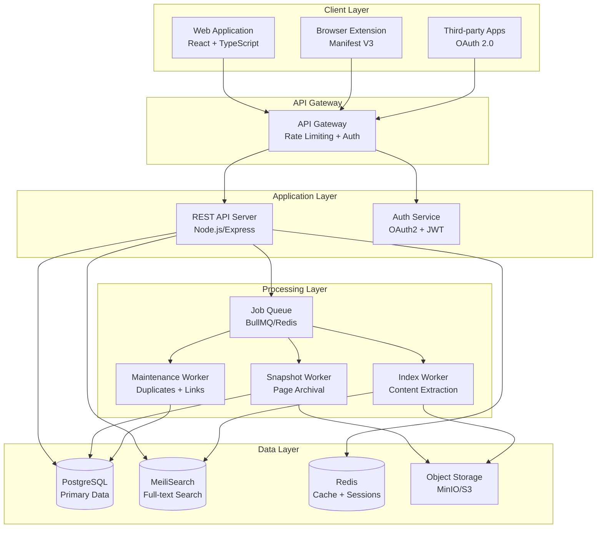

# Bookmark Manager Platform

A production-ready, cross-platform bookmark management platform with comprehensive organization, archiving, search, and collaboration capabilities.

## 🌟 Features

### Free Tier

- ✅ **Unlimited Bookmarks** - Save unlimited web pages, articles, videos, and images
- 📁 **Collections** - Organize bookmarks in hierarchical folders with custom icons
- 🏷️ **Multi-Tag Support** - Tag bookmarks with multiple labels for flexible organization
- 🔍 **Basic Search** - Search by title, URL, tags, and notes
- 🔄 **Real-time Sync** - Synchronize across all devices via WebSocket
- 🌐 **Browser Extension** - Quick save from Chrome, Firefox, Safari, Edge
- 📤 **Import/Export** - Migrate data in HTML, JSON, CSV, and TXT formats
- 🎨 **Multiple Views** - Grid, Headlines, Masonry, and List layouts
- 🔗 **Duplicate Detection** - Automatic detection of duplicate bookmarks
- 🚨 **Broken Link Scanner** - Identify inaccessible bookmarks

### Pro Tier

- 🔎 **Full-text Search** - Search within saved page content, PDFs, and EPUBs
- 💾 **Permanent Archival** - Store complete page snapshots for offline access
- ✨ **Highlights & Annotations** - Mark text and add rich Markdown notes
- 👥 **Collaboration** - Share collections with specific users or publicly
- 📎 **File Uploads** - Attach PDFs, images, and documents
- 🔄 **Automated Backups** - Daily backups with 30-day retention
- ⏰ **Reminders** - Set notifications for bookmarks
- ⚡ **Batch Operations** - Bulk tag, move, and delete operations
- 📊 **Custom Ordering** - Drag-and-drop manual sorting

## 🏗️ Architecture

### System Overview



### Monorepo Structure

This is a Turborepo monorepo with pnpm workspaces:

- **`packages/backend`** - Node.js/Express REST API server with background workers
- **`packages/frontend`** - React web application with Vite
- **`packages/extension`** - Browser extension (Manifest V3) for Chrome, Firefox, Safari, Edge
- **`packages/shared`** - Shared TypeScript types and utilities

## 🚀 Quick Start

### Prerequisites

- **Node.js** 20+ ([Download](https://nodejs.org/))
- **pnpm** 10+ - Install with `npm install -g pnpm`
- **Docker Desktop** ([Download](https://www.docker.com/products/docker-desktop))

### Installation

1. **Clone the repository**

   ```bash
   git clone https://github.com/yourusername/bookmark-manager-platform.git
   cd bookmark-manager-platform
   ```

2. **Install dependencies**

   ```bash
   pnpm install
   ```

3. **Start Docker services**

   ```bash
   pnpm docker:up
   ```

   This starts PostgreSQL, Redis, MeiliSearch, and MinIO.

4. **Configure environment**

   ```bash
   cp packages/backend/.env.example packages/backend/.env
   ```

   The default values work with Docker Compose.

5. **Run database migrations**

   ```bash
   cd packages/backend
   pnpm run migrate
   cd ../..
   ```

6. **Start development servers**

   ```bash
   pnpm dev
   ```

7. **Access the application**
   - **Frontend**: http://localhost:5173
   - **Backend API**: http://localhost:3000
   - **MeiliSearch**: http://localhost:7700
   - **MinIO Console**: http://localhost:9001 (minioadmin/minioadmin)

For detailed setup instructions, see [QUICKSTART.md](QUICKSTART.md).

## 📁 Project Structure

```
bookmark-manager-platform/
├── .github/
│   └── workflows/           # CI/CD pipelines
├── .kiro/
│   ├── specs/              # Feature specifications
│   └── steering/           # Development guidelines
├── e2e/                    # End-to-end tests (Playwright)
├── k8s/                    # Kubernetes manifests
├── load-tests/             # Load testing scripts (k6)
├── packages/
│   ├── backend/            # Node.js API server
│   │   ├── migrations/     # Database migrations
│   │   ├── src/
│   │   │   ├── db/         # Database configuration
│   │   │   ├── middleware/ # Express middleware
│   │   │   ├── queue/      # Job queue and workers
│   │   │   ├── repositories/ # Data access layer
│   │   │   ├── routes/     # API routes
│   │   │   ├── services/   # Business logic
│   │   │   ├── utils/      # Utilities
│   │   │   └── websocket/  # WebSocket handlers
│   │   ├── openapi.yaml    # API specification
│   │   └── package.json
│   ├── frontend/           # React web application
│   │   ├── src/
│   │   │   ├── components/ # React components
│   │   │   ├── hooks/      # Custom hooks
│   │   │   ├── layouts/    # Page layouts
│   │   │   ├── lib/        # API client
│   │   │   ├── pages/      # Page components
│   │   │   ├── routes/     # Route definitions
│   │   │   └── stores/     # Zustand stores
│   │   └── package.json
│   ├── extension/          # Browser extension
│   │   ├── src/
│   │   │   ├── background.ts  # Service worker
│   │   │   ├── content.ts     # Content script
│   │   │   ├── popup.ts       # Popup UI
│   │   │   └── sidepanel.ts   # Side panel UI
│   │   ├── manifest.json
│   │   └── package.json
│   └── shared/             # Shared TypeScript types
│       ├── src/types/
│       └── package.json
├── scripts/                # Utility scripts
├── terraform/              # Infrastructure as code
├── docker-compose.yml      # Local development services
├── package.json            # Root package
├── pnpm-workspace.yaml     # pnpm workspace config
└── turbo.json             # Turborepo configuration
```

## 💻 Development

### Available Commands

**Root-level commands:**

```bash
# Development
pnpm dev                    # Start all packages in dev mode
pnpm build                  # Build all packages
pnpm clean                  # Clean build artifacts

# Testing
pnpm test                   # Run tests in watch mode
pnpm test:run               # Run all tests once
pnpm test:e2e               # Run E2E tests (Playwright)

# Code Quality
pnpm lint                   # Lint all packages
pnpm format                 # Format code with Prettier
pnpm format:check           # Check formatting

# Docker Services
pnpm docker:up              # Start PostgreSQL, Redis, MeiliSearch, MinIO
pnpm docker:down            # Stop Docker services
pnpm docker:logs            # View Docker logs
```

**Package-specific commands:**

```bash
# Backend
pnpm --filter @bookmark-manager/backend dev
pnpm --filter @bookmark-manager/backend build
pnpm --filter @bookmark-manager/backend test:run
pnpm --filter @bookmark-manager/backend migrate

# Frontend
pnpm --filter @bookmark-manager/frontend dev
pnpm --filter @bookmark-manager/frontend build
pnpm --filter @bookmark-manager/frontend test:run

# Extension
pnpm --filter @bookmark-manager/extension dev
pnpm --filter @bookmark-manager/extension build
pnpm --filter @bookmark-manager/extension test:run
```

### Development Workflow

1. **Start Docker services** - `pnpm docker:up`
2. **Run migrations** - `cd packages/backend && pnpm migrate`
3. **Start dev servers** - `pnpm dev`
4. **Make changes** - Edit code in `packages/*/src/`
5. **Run tests** - `pnpm test:run`
6. **Lint and format** - `pnpm lint && pnpm format`
7. **Commit changes** - Follow conventional commits

### Testing Strategy

The project uses a comprehensive testing approach:

- **Unit Tests** (Vitest) - Test individual functions and components
- **Property-Based Tests** (fast-check) - Verify correctness properties across all inputs
- **Integration Tests** (Vitest) - Test API endpoints and service interactions
- **E2E Tests** (Playwright) - Test complete user workflows
- **Load Tests** (k6) - Verify performance under load

```bash
# Run unit and property tests
pnpm test:run

# Run integration tests
pnpm --filter @bookmark-manager/backend test:run

# Run E2E tests
pnpm test:e2e

# Run load tests
cd load-tests && k6 run concurrent-users.js
```

### Code Quality Standards

- **TypeScript** - Strict mode enabled, no implicit any
- **ESLint** - Enforces code style and catches errors
- **Prettier** - Consistent code formatting
- **Conventional Commits** - Structured commit messages
- **Property-Based Testing** - Validates correctness properties from design document

## 🛠️ Technology Stack

### Backend

- **Runtime**: Node.js 20+ with Express.js
- **Database**: PostgreSQL 15+ with connection pooling
- **Cache**: Redis 7+ for sessions and job queue
- **Search**: MeiliSearch for full-text search
- **Storage**: MinIO (S3-compatible) for snapshots and files
- **Queue**: BullMQ for background job processing
- **Auth**: Passport.js with OAuth 2.0 + PKCE and JWT
- **Validation**: Zod for runtime type validation
- **Testing**: Vitest + fast-check for property-based testing

### Frontend

- **Framework**: React 18 with TypeScript
- **Build Tool**: Vite for fast development and optimized builds
- **Styling**: Tailwind CSS with custom design system
- **State Management**: Zustand for client state
- **Server State**: React Query (@tanstack/react-query) for API caching
- **Routing**: React Router v6
- **HTTP Client**: Axios with interceptors
- **Testing**: Vitest + React Testing Library

### Browser Extension

- **Standard**: Manifest V3 for Chrome, Firefox, Safari, Edge
- **API**: WebExtensions with polyfill for cross-browser compatibility
- **Build**: TypeScript compilation with bundling
- **Auth**: OAuth 2.0 with PKCE flow

### Infrastructure

- **Containerization**: Docker with multi-stage builds
- **Orchestration**: Kubernetes with Helm charts
- **IaC**: Terraform for AWS infrastructure
- **CI/CD**: GitHub Actions with automated testing and deployment
- **Monitoring**: Prometheus + Grafana for metrics and alerting

### Development Tools

- **Monorepo**: Turborepo for task orchestration
- **Package Manager**: pnpm with workspaces
- **Linting**: ESLint with TypeScript support
- **Formatting**: Prettier with consistent configuration
- **Testing**: Vitest, Playwright, k6 for load testing

## 🐳 Docker Services

The development environment includes these services:

| Service       | Port                          | Purpose           | Credentials                   |
| ------------- | ----------------------------- | ----------------- | ----------------------------- |
| PostgreSQL 15 | 5432                          | Primary database  | bookmark_user / bookmark_pass |
| Redis 7       | 6379                          | Cache & job queue | No password (dev only)        |
| MeiliSearch   | 7700                          | Full-text search  | Master key: masterKey123      |
| MinIO         | 9000 (API)<br/>9001 (Console) | Object storage    | minioadmin / minioadmin       |

**Access URLs:**

- MeiliSearch: http://localhost:7700
- MinIO Console: http://localhost:9001

## 📚 Documentation

- **[Quick Start Guide](QUICKSTART.md)** - Get up and running in minutes
- **[Setup Guide](SETUP.md)** - Detailed setup and configuration
- **[API Documentation](docs/API.md)** - Complete API reference with examples
- **[Deployment Guide](docs/DEPLOYMENT.md)** - Production deployment instructions
- **[Architecture](docs/ARCHITECTURE.md)** - System design and architecture decisions
- **[Contributing](CONTRIBUTING.md)** - How to contribute to the project

### Specification Documents

- **[Requirements](.kiro/specs/bookmark-manager-platform/requirements.md)** - Detailed requirements with EARS patterns
- **[Design](.kiro/specs/bookmark-manager-platform/design.md)** - System design with correctness properties
- **[Tasks](.kiro/specs/bookmark-manager-platform/tasks.md)** - Implementation task list

## 🚢 Deployment

### Docker Compose (Development)

```bash
docker-compose up -d
```

### Docker Compose (Production)

```bash
docker-compose -f docker-compose.prod.yml up -d
```

### Kubernetes

```bash
# Deploy to Kubernetes
cd k8s
./deploy.sh production

# Or use kubectl directly
kubectl apply -k overlays/production
```

### Terraform (AWS)

```bash
cd terraform/environments/production
terraform init
terraform plan
terraform apply
```

See [docs/DEPLOYMENT.md](docs/DEPLOYMENT.md) for detailed deployment instructions.

## 🔒 Security

- **Authentication**: JWT with RS256 signing + OAuth 2.0 with PKCE
- **Authorization**: Role-based access control (RBAC) with plan tier enforcement
- **Encryption**: TLS 1.3 for all client-server communication
- **Input Validation**: Zod schemas with sanitization
- **SQL Injection**: Parameterized queries with pg library
- **Rate Limiting**: Per-user and per-IP rate limits
- **CORS**: Configured for specific origins
- **CSP**: Content Security Policy headers
- **GDPR**: Complete data export and deletion capabilities

## 🤝 Contributing

We welcome contributions! Please see [CONTRIBUTING.md](CONTRIBUTING.md) for guidelines.

### Development Process

1. Fork the repository
2. Create a feature branch (`git checkout -b feature/amazing-feature`)
3. Make your changes
4. Run tests (`pnpm test:run`)
5. Commit with conventional commits (`git commit -m 'feat: add amazing feature'`)
6. Push to your branch (`git push origin feature/amazing-feature`)
7. Open a Pull Request

### Commit Convention

We use [Conventional Commits](https://www.conventionalcommits.org/):

- `feat:` - New features
- `fix:` - Bug fixes
- `docs:` - Documentation changes
- `test:` - Test additions or changes
- `refactor:` - Code refactoring
- `perf:` - Performance improvements
- `chore:` - Build process or tooling changes

## 📊 Performance

- **API Response Time**: < 200ms (95th percentile)
- **Search Latency**: < 200ms for 100k bookmarks
- **Concurrent Users**: Tested up to 1000 concurrent users
- **Database**: Connection pooling with optimized indexes
- **Caching**: Redis for frequently accessed data
- **CDN**: Static assets served via CDN

## 📄 License

This project is proprietary software. All rights reserved.

## 🙏 Acknowledgments

- Built with [React](https://react.dev/), [Express](https://expressjs.com/), and [PostgreSQL](https://www.postgresql.org/)
- Search powered by [MeiliSearch](https://www.meilisearch.com/)
- Property-based testing with [fast-check](https://fast-check.dev/)
- Icons from [Lucide](https://lucide.dev/)

## 📞 Support

- **Documentation**: See [docs/](docs/) directory
- **Issues**: [GitHub Issues](https://github.com/yourusername/bookmark-manager-platform/issues)
- **Email**: support@bookmarkmanager.example.com

---

Made with ❤️ by the Bookmark Manager Team
